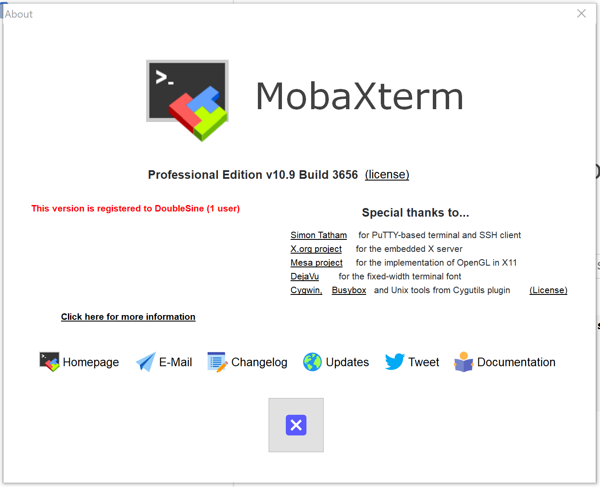

# MobaXterm Keygen

## How it work?

Please see source code. It is not complex.

## How to use?

```
Usage:
    MobaXterm-Keygen.py <UserName> <Version>

    <UserName>:      The Name licensed to
    <Version>:       The Version of MobaXterm
                     Example:    10.9
```

EXAMPLE:

```
PS C:\Users\DoubleSine\Github\MobaXterm-Keygen> .\MobaXterm-Keygen.py "DoubleSine" 10.9
[*] Success!
[*] File generated: C:\Users\DoubleSine\Github\MobaXterm-Keygen\Custom.mxtpro
[*] Please move or copy the newly-generated file to MobaXterm's installation path.
```

Then copy `Custom.mxtpro` to `C:\Program Files (x86)\Mobatek\MobaXterm`.

## Screenshot



## Postscript

1. This application does not have complex activation algorithm and it is truly fantastic. __So please pay for it if possible.__

2. The file generated, `Custom.mxtpro`, is actually a zip file and contains a text file, `Pro.key`, where there is a key string. 

3. `MobaXterm.exe` has another mode. You can see it by adding a parameter `"-customizer"`.

   ```
   $ .\MobaXterm.exe -customizer
   ```

   I don't know how to make custom settings take effect in `Customizer` mode directly. 
   
   The only way I found is that you should export custom settings to a file named `MobaXterm customization.custom` which is also a zip file. Then merge two zip file: `Custom.mxtpro` and `MobaXterm customization.custom` to `Custom.mxtpro`. Finally copy newly-generated `Custom.mxtpro` to MobaXterm's installation path.

